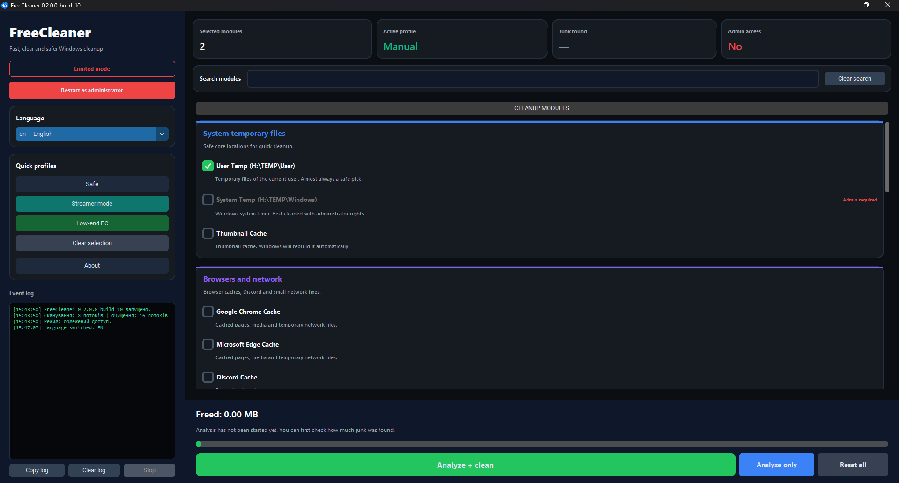

# FreeCleaner


FreeCleaner is a lightweight Windows desktop utility focused on cleaning temporary and non-essential files in a simple, clear, and privacy-friendly way.

The project is designed around a local-first workflow, understandable actions, and a clean desktop experience without unnecessary clutter.

---

## Overview

FreeCleaner helps users remove junk data, temporary files, and other low-value leftovers that build up over time on Windows systems.

The main goal of the project is not to become a bloated "all-in-one miracle optimizer," but to stay:

- simple
- readable
- local-first
- user-controlled
- practical for everyday use

---

## Features

- Clean temporary and non-essential files
- Simple desktop interface
- Local-first workflow
- Privacy-friendly design
- Built-in access to bundled project documents
- Support for custom language packs
- Lightweight structure focused on clarity and usability

---

## Why FreeCleaner

Many cleanup tools become overloaded with ads, confusing controls, background behavior, or unnecessary features.

FreeCleaner is built with a different approach:

- predictable behavior
- clear interface
- understandable cleanup actions
- no intentional hidden data collection
- easier customization and localization

In short: it tries to clean the PC, not the user’s patience.

---

## Screenshots

Add your screenshots here after publishing visuals for the project.

```md

```

---

## Project Structure

A typical structure may look like this:

```text
FreeCleaner/
├─ app.py
├─ freecleaner/
│  ├─ app.py
│  ├─ design.py
│  ├─ logic.py
│  ├─ version_info.py
│  └─ ...
├─ languages/
│  └─ *.json
├─ assets/
│  ├─ icons/
│  └─ screenshots/
├─ LICENSE
├─ PRIVACY_POLICY.txt
└─ README.md
```

---

## Requirements

- Windows 10 or Windows 11
- Python 3.x
- Project dependencies required by the application

---

## Installation

### Run from source

Make sure Python is installed, then run:

```bash
python app.py
```

If the entry point is different in your setup, run the correct startup file for your project.

### Install dependencies

If the project includes a requirements file:

```bash
pip install -r requirements.txt
```

If not, install the dependencies manually according to the project modules you use.

---

## Build an executable

If you package FreeCleaner into an `.exe`, make sure all required assets are included:

- icons
- language files
- `LICENSE`
- `PRIVACY_POLICY.txt`
- images and other UI resources

Example with PyInstaller:

```bash
pyinstaller app.spec
```

Or:

```bash
pyinstaller --noconfirm --onefile --windowed app.py
```

Adjust the command to fit your real project structure.

---

## Custom Language Packs

FreeCleaner supports external JSON language files.

Each custom language file should include a `NAME` field used as the visible language name in the UI.

Example:

```json
{
  "NAME": "English",
  "app_title": "FreeCleaner",
  "close": "Close"
}
```

### Notes

- Built-in languages may be handled separately from external ones
- External language files should be placed in the correct language folder next to the application
- Translation keys should stay consistent with the application’s expected structure
- User-friendly naming is recommended for public distributions

---

## Documents

FreeCleaner includes bundled project documents that can be opened from the application:

- **LICENSE** — explains how the software may be used and distributed
- **PRIVACY_POLICY.txt** — explains what the app does and does not do with user data

---

## Privacy

FreeCleaner is designed to work locally on the user’s PC.

It does **not** intentionally upload personal files, cleanup results, or private documents to external servers.

Typical operations are performed locally and only for the cleanup actions selected by the user.

For more details, see:

- `PRIVACY_POLICY.txt`
- `LICENSE`

---

## Main Principles

- **Local first** — cleanup happens on the user’s device
- **User control** — the user decides what to run
- **Clear UI** — no hidden magic and no unnecessary clutter
- **Readable documentation** — bundled documents are easy to access
- **Extensible languages** — translations can be added through JSON files

---

## Current Focus

Current development priorities include:

- improving UI clarity
- improving rendering performance
- refining cleanup flows
- making language support easier to maintain
- keeping the project lightweight and understandable

---

## Limitations

FreeCleaner is not intended to be:

- a cloud sync utility
- a remote monitoring tool
- an antivirus
- a full replacement for professional enterprise maintenance tools

It is a focused desktop cleanup utility.

---

## FAQ

### Does FreeCleaner upload my files?

No. FreeCleaner is designed as a local-first desktop utility and is not intended to upload your personal files as part of normal usage.

### Does it require an account?

No. FreeCleaner does not require an account for local use.

### Can I add my own language?

Yes. External JSON language packs can be added if they follow the expected translation key structure.

### Is it safe to use?

It is designed to be simple and transparent, but users should always review cleanup actions before confirming deletion.

### Can I build it into an `.exe`?

Yes. A packaged executable can be built with tools such as PyInstaller, as long as required resources are included.

---

## Contributing

Contributions, improvements, bug reports, UI suggestions, and translation updates are welcome.

You can contribute by:

- reporting bugs
- improving translations
- refining the interface
- optimizing performance
- improving documentation

---

## License

This project is licensed under the MIT License.

See the `LICENSE` file for details.
